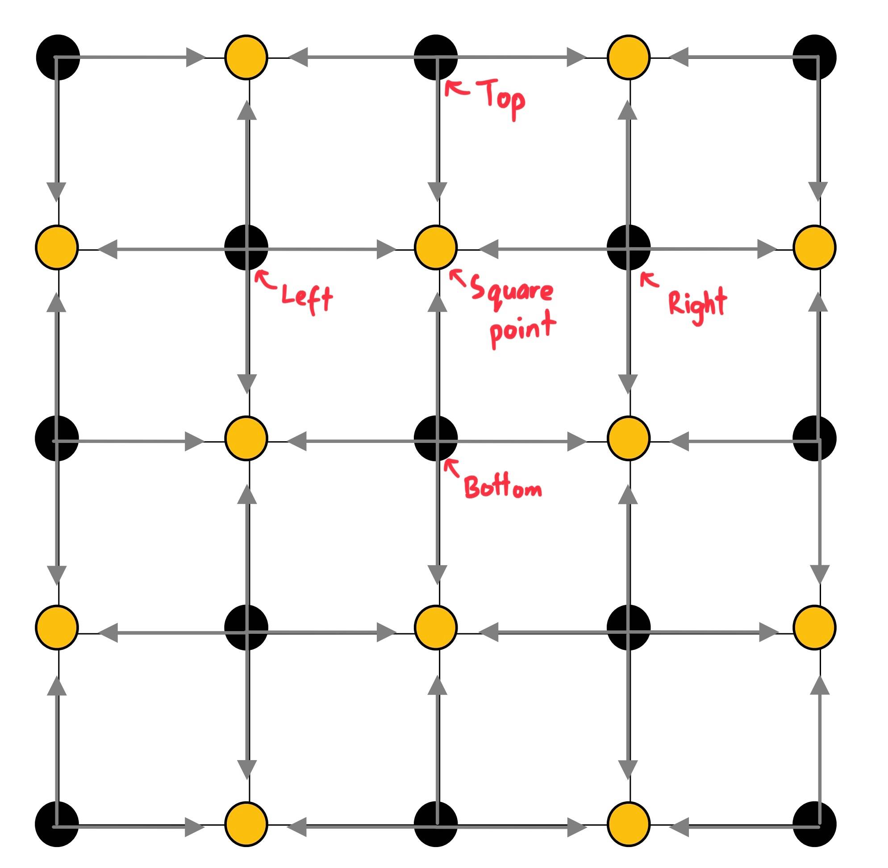
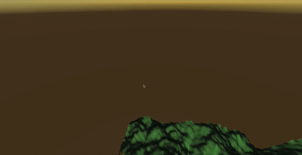
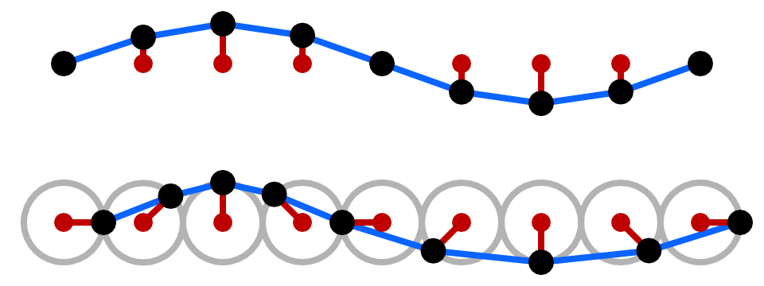

**The University of Melbourne**

# COMP30019 – Graphics and Interaction

# Project-1 README

## Table of contents

- [Team Members](#team-members)
- [General info](#general-info)
- [Technologies](#technologies)
- [Diamond-Square implementation](#diamond-square-implementation)
	- [Overall For Loop that determines number of iterations](#overall-for-loop-that-determines-number-of-iterations)
	- [Diamond Step](#diamond-step)
		- [Nested For Loop to iterate through regions](#nested-for-loop-to-iterate-through-regions)
		- [Getting the corner values and midpoint of the square](#getting-the-corner-values-and-midpoint-of-the-square)
	- [Square Step](#square-step)
		- [Nested For Loop to iterate through the height map](#nested-for-loop-to-iterate-through-the-height-map)
		- [Getting the corner values and dealing with edge cases](#getting-the-corner-values-and-dealing-with-edge-cases)
- [Geometry of Terrain](#geometry-of-terrain)
	- [Generating the Terrain](#generating-the-terrain)
	- [Calculate Terrain Normals](#calculating-terrain-normals)
- [Camera Motion](#camera-motion)
- [Phong Illumination Justification](#phong-illumination-justification)
	- [Terrain Surface](#terrain-surface)
	- [Water Surface](#water-surface)
- [Vertex Shader](#vertex-shader)
	- [Wave implementation](#wave-implementation)
	- [Calculating Normals](#calculating-normals)

## Team Members

| Name           |           Task           | State |
| :------------- | :----------------------: | ----: |
| Nikolas Leander Putra |        Terrain, Camera Motion, Illumination & ColorShader         |  Done |
| Girish Madnani |      Camera Motion       |  Done |
| Kelvin Hu      |  Sunlight & WaveShader   |  Done |
| Kevin Linarto  | Diamond Square & Terrain |  Done |

## General info

This is project - 1...
Where our group used fractals to automatically generate a 3D landscape that will regenerate when space is pressed, and enables a user to navigate around
the landscape in a 'flight simulator' style. The landscape is generated through the implementation of Diamond-Square-Algorithm with a custom HLSL shader built
based on the Phong illumination model to display realistic lighting

## Technologies

Project is created with:

-   Unity 2019.4.3f1
-   Ipsum version: 2.33
-   Ament library version: 999

## Diamond-Square implementation

### Overall For Loop that determines number of iterations

This is the main loop that is used to go through the square. After doing both one diamond and square step, the side length of the square is halved, which is sideLength. The loop will keep halving the side length of the square until the smallest possible square is reached, a side length of 2, which is 3 vertices.

The initial side length of the square will always be odd since the side length is 2<sup>n</sup> + 1, i.e. Even + Odd = Odd. Halving the initial side length results in the side length to be rounded down to an integer, since the algorithm is using integer division. E.g. 5/2 = 2 not 2.5.

```c#
for (int sideLength = nDivisions; sideLength >= 2; sideLength /= 2)
{
	// Run Diamond and Square Step
}
```

### Diamond Step

#### Nested For Loop to iterate through regions

The Diamond Step is done in regions that is determine by the side length of the square, i.e. the smaller the side length, the more regions iterated through, resulting in more iterations of both x and y.

```c#
for (int x = 0; x < nDivisions; x += sideLength)
	{
		for (int y = 0; y < nDivisions; y += sideLength)
		{
			// Set midpoint of current square to be average
			// of the four corner points plus a random value
		}
	}
```

#### Getting the corner values and midpoint of the square

The Diamond Step always begins in the top left corner (0, 0), and iterates through the region getting the top left of each region, as from the top left corner, we can determine the three other corners as they are side length apart. The midpoint of the current square can be found by adding half the side length of the current square to the top left point.

```c#
float cornerValues =
	heightMap[x, y]  // Top Left
	+ heightMap[x + sideLength, y]  // Top Right
	+ heightMap[x, y + sideLength]  // Bottom Left
	+ heightMap[x + sideLength, y + sideLength];  // Bottom Right
```

### Square Step

The implementation of the square step is slightly different, instead of setting the mid point of that specified diamond to be the average of the four corner points. I'll be setting the square points, the points where we'll set the square value for the current square, to be the average of the top, left, bottom and right points.

<figure align="center">
  
</figure>

#### Nested For Loop to iterate through the height map

Since the Diamond Square Algorithm creates a height map represented as a 2D array, we can use[x, y] to assign the values, which also results in dealing with the edge cases easily. Instead of iterating through the regions, we iterate through the array using a nested loop, i.e. go through all y values for each x, e.g. [0, 1] -> [0,3] -> [1, 0] -> [x, y]. The x values will be incremented with half the square size as the x-distance between square points, (the point where we'll set the square value), is half the square size.

The y values on the other hand will be incremented by the size of the square as the y-distance between the square points is the size of the square. However, there is a pattern on where the y value starts for each x value. When x is 0, y is never 0 as (0, 0) is already set in the beginning, thus we can determine the y value using the formula (x + half the square size) % sideLength.

E.g. x = 0, halfRegion = 2, sideLength = 4 will give us the point (0, 2), which is one of the square points when the square size is 4.

```c#
for (int x = 0; x <= nDivisions; x += halfRegion)
{
	for (int y = (x + halfRegion) % sideLength; y <= nDivisions; y += sideLength)
	{
		// Set square point to be the average of the four/three
		// corner points plus a random value
	}
}
```

#### Getting the corner values and dealing with edge cases

Getting the corner points is simple, as we only add points that are present in the square, in respect to the square point. E.g. Square point (0, 1) doesn't have a left point, which would be (-1, 1), as it is out of bounds but would have the top (0, 0), right (1, 1) and bottom (0, 2). Square points not on the edges will have four points.

```c#
// If the square point has a point to the right of itself
// add the right point
if (x + halfRegion <= nDivisions)
{
	cornerValues += heightMap[rightX, rightY];
	numCorners++;
}

// If the square point has a point to the left of itself
// add the left point
if (x - halfRegion >= 0)
{
	cornerValues += heightMap[leftX, leftY];
	numCorners++;
}

// If the square point has a point above
// add the top point
if (y - halfRegion >= 0)
{
	cornerValues += heightMap[topX, topY];
	numCorners++;
}

// If the square point has a point below
// add the bottom point
if (y + halfRegion <= nDivisions)
{
	cornerValues += heightMap[bottomX, bottomY];
	numCorners++;
}

float avg = cornerValues / numCorners;
```
## Geometry of Terrain

The terrain was created by creating a flat plane which we later alter the vertices of y-values by using a height map. Creating the height map first makes it easier to set the y-values of the vertices of the plane and allows us to deal with the edge cases more easily, as the height map is represented as a 2D array.

### Generating the Terrain

A custom flat plane was created first. This is done is the function **GeneratePlane**. Using the Diamond-Sqaure algorithm, a height map was created and this is used to replace the y-values of the vertices array in the flat plane mesh shown in the function **TransferToMesh**.

```c#
void TransferToMesh(float[,] heightMap, int numVerticesRow)
{
	int index = 0;
	for (int i = 0; i < numVerticesRow; i++)
	{
		for (int j = 0; j < numVerticesRow; j++)
		{
			vertices[index].y = heightMap[i, j];
			index++;
		}
	}
}
```

### Calculating Terrain Normals

To calculate the noramls, an inbuilt unity function was used to calculate the terrain normals.

```c#
m.RecalculateNormals();
```

## Camera Motion

The camera uses a flight simulator style implementation. The mouse controls the pitch and yaw of the camera. Key 'w' moves in the forward direction relative to the camera, key 's' moves in the backward direction relative to the camera. Key 'a' moves in the left direction relative to the camera and key 'd' moves in the right direction relative to the camera. To move upwards or downwards i.e. along the y direction we have to use the pitch and yaw (controlled by the mouse) to face downwards or upwards of the terrain, as well as keys 'w' or 's' to move the camera towards the direction you want simultaneously.

To move the camera, **AddRelativeForce** was used for the rigidbody of the camera so that it can easily interact with collision detection of the terrain. To stop the camera from moving infinitely towards a direction, the attribute "drag" in rigidbody was increased.

<p align="center">
  
  <p align="center"> fig 1: Camera Movement </p>
</p>

The camera follows the user and can move anywhere in the world, but cannot see underground nor can it go out of the worlds boundries. The boundries were created by creating a terrain component Box Collider, which help us obtain the minimum and maximum values for x and z coordinates.

<p align="center">
  
  <p align="center"> fig 2: Camera Boundries </p>
</p>

The camera initially loads up to a default coordinate position of (-21f,35f,-20f) and each time the terrain transform position is reseted to that same default coordinate position. Similarly the camera's pitch and yaw default rotation angle is set to (-(63), 41, 0) and resets to that default rotation angle. Pitch also cannot exceed 120f and -120f to prevent camera inversion.

<p align="center">
  
  <p align="center"> fig 3: Reset Camera </p>
</p>

## Phong Illumination Justification

### Terrain Surface

- Ka = 0.6
- Kd = 1
- Ks = 0.1
- specN = 1

Since Ka parameter determines albedo, if it is set too high, the proportion of light reflected would be to high, if set too low, there are not enough light reflected by the terrain. We felt that a Ka value of 0.6 for the terrain produce good lighting. Kd was set to 1 as we want to have a diffuse component. Ks was set to 0.1, because terrain and mountains do not produce bright highlights when light is shining on it.

#### Water Surface

- Ka = 0.5
- Kd = 1
- Ks = 0.5
- specN = 20

We felt that a Ka value of 0.5 for the water produce good base lighting. Kd was set to 1 as we want to have a diffuse component. Ks and specN was set to higher values compared to the terrain's with Ks of 0.5 and specN of 20. This is because realistic water tend to have a high specular component, which will show bright highlights when light is shining on it. 

## Vertex Shader

#### Wave implementation

The wave is implemented using a HLSL Shader, the shader is attatched to a plane generated with the function **GeneratePlane** within the TerrainGeneration script. Instead of using the regular sin wave, a more realistic wave function was used name "Gerstner". We've decided to not only change the y value of the vertex in a sine function depended on the amplitude, wavelength, time elapsed, and the x value of the vertex to emulate wave like motion, we've also decided to change the x value of the vertex in a cos function to emulate a circular motion of the plane on which the wave was created, this was done in order to create a irregular movement like a real wave, hence making it more realistic.

A helpful site to understand the math and implementation : https://catlikecoding.com/unity/tutorials/flow/waves/

<figure align="left">
  
  <p>Figure 4: sin wave vs gerstner wave</p>
</figure>

The following code allows the 3D plane to appear to be moving in a wave like motion through changing the x and y value of vertex based on time elapsed, amplitude (the max point of oscillation), wavelength and speed. Amplitude was set to 0.3, speed was set to 2 and wavelength was set to 2.0f*UNITY_PI / 10.0f for a realistic look on the wave.

```ShaderLab
float amp = 0.3f, speed = 2.0f, speedtime = speed * _Time.y, wavelength = 2.0f*UNITY_PI / 10.0f;

float f = wavelength * (v.vertex.x - speed * _Time.y); 
v.vertex.x += amp * cos(f);
v.vertex.y += amp * sin(f);
```

#### Calculating Normals

The following code first calculates the tangent of the vertices where x = derivative of v.vertex.x, y = derivative of v.vertex.y, z = 0, and then calculates the normal, then converts them into worldVertex and worldNormal for the fragment shader

```ShaderLab
float3 tangent = normalize(float3(1- wavelength * amp * sin(f), amp * wavelength * cos(f), 0));
float3 normal = float3(-tangent.y, tangent.x, 0);

float4 worldVertex = mul(unity_ObjectToWorld, v.vertex);
float3 worldNormal = normalize(mul(transpose((float3x3)unity_WorldToObject), normal));
```

**Now Get ready to complete all the tasks:**

-   [x] Read the handout for Project-1 carefully
-   [x] Modelling of fractal landscape
-   [x] Camera motion
-   [x] Surface properties
-   [x] Project organisation and documentation
